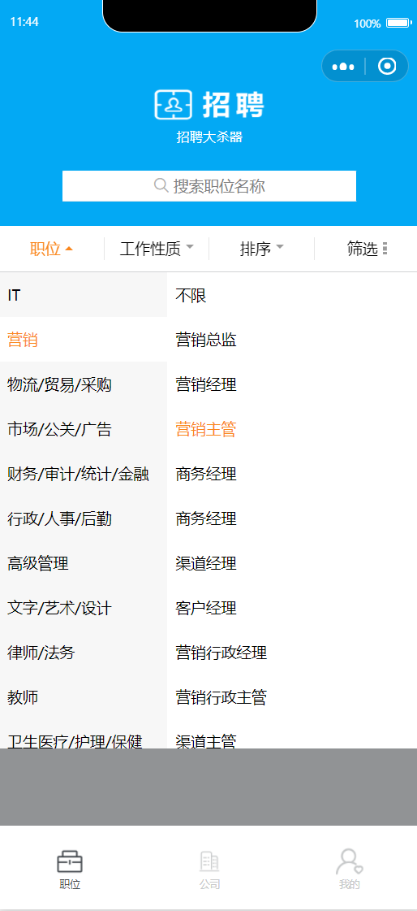
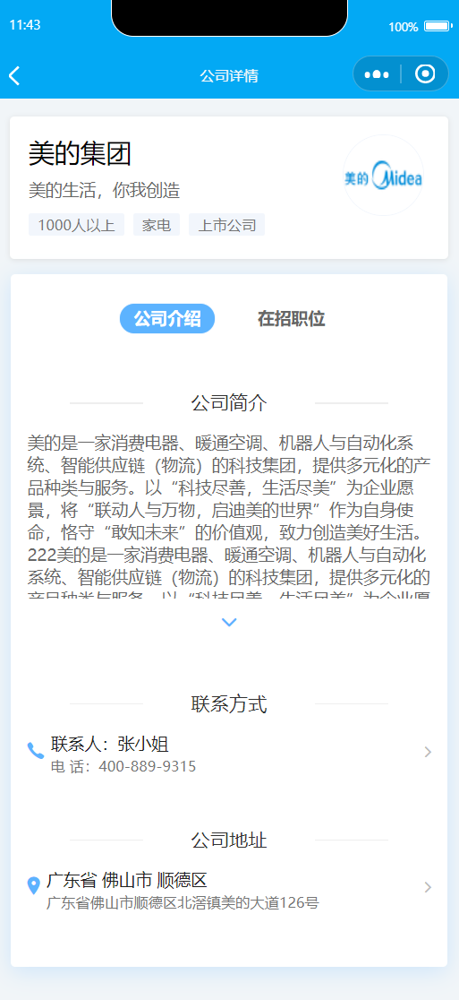
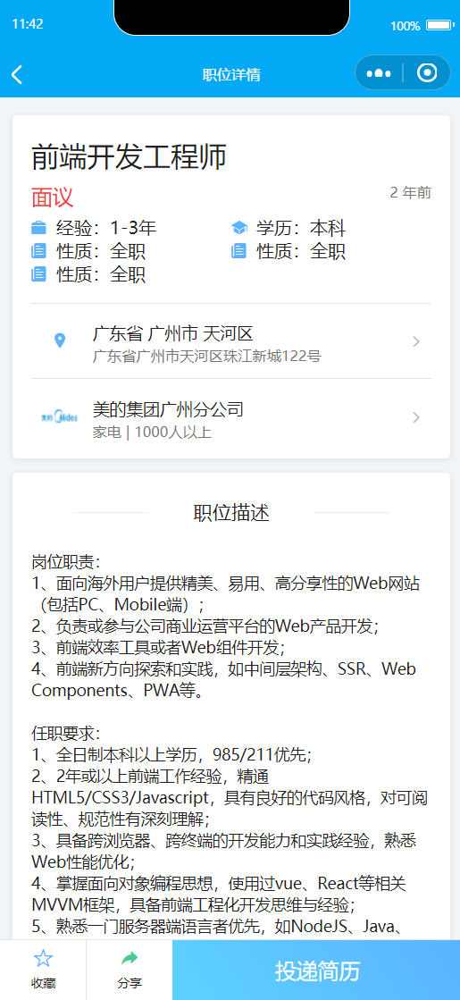
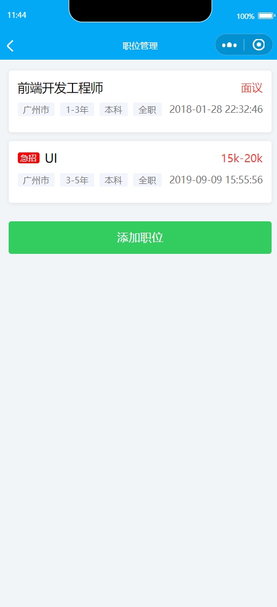
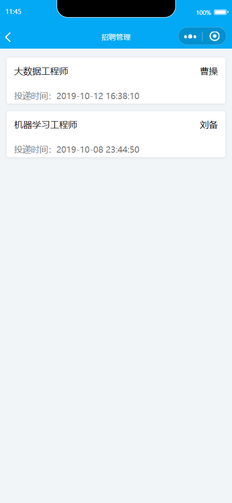
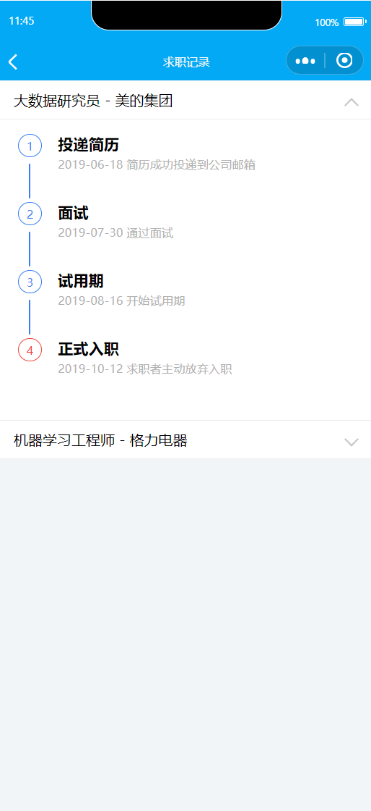

# 微信招聘小程序

[English](./README.md) | 简体中文

微信小程序——微招聘

## 简介

只有前端，功能基本如图所示，部分功能因故暂时搁置开发。

## 预览

<table>
	<tr>
		<td></td>
		<td></td>
		<td></td>
	</tr>
	<tr>
		<td></td>
		<td></td>
		<td></td>
	</tr>
	<tr>
		<td></td>
		<td></td>
		<td></td>
	</tr>
	<tr>
		<td></td>
		<td></td>
		<td></td>
	</tr>
	<tr>
		<td></td>
	</tr>
</table>
