# Wechat-MiniJob

## 简介

招聘小程序

## 预览

<table>
	<tr>
		<td>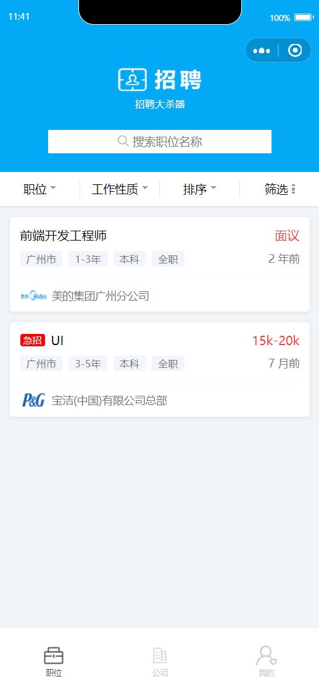</td>
		<td>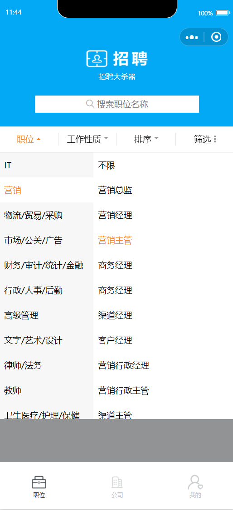</td>
		<td></td>
	</tr>
	<tr>
		<td>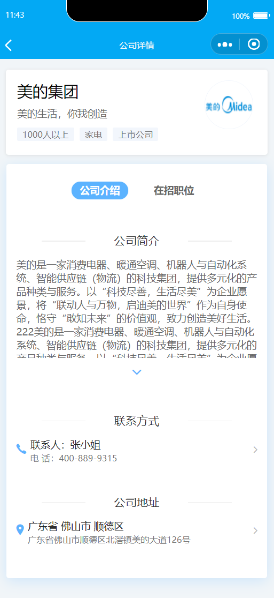</td>
		<td>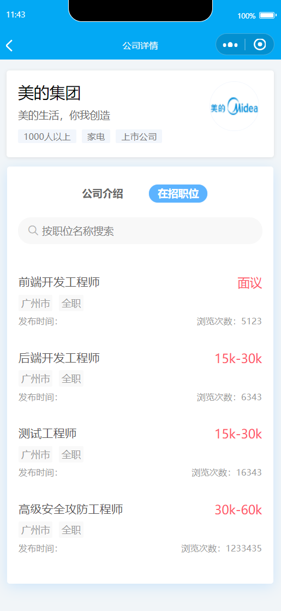</td>
		<td>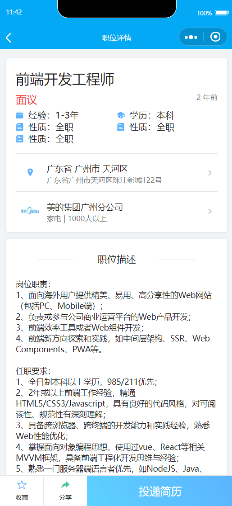</td>
	</tr>
	<tr>
		<td>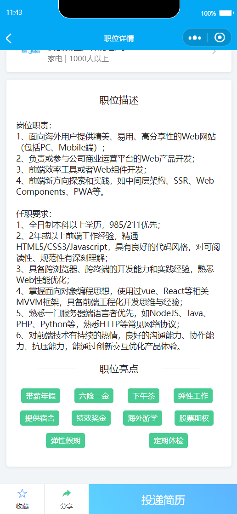</td>
		<td>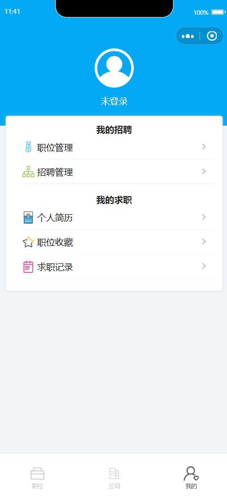</td>
		<td></td>
	</tr>
	<tr>
		<td>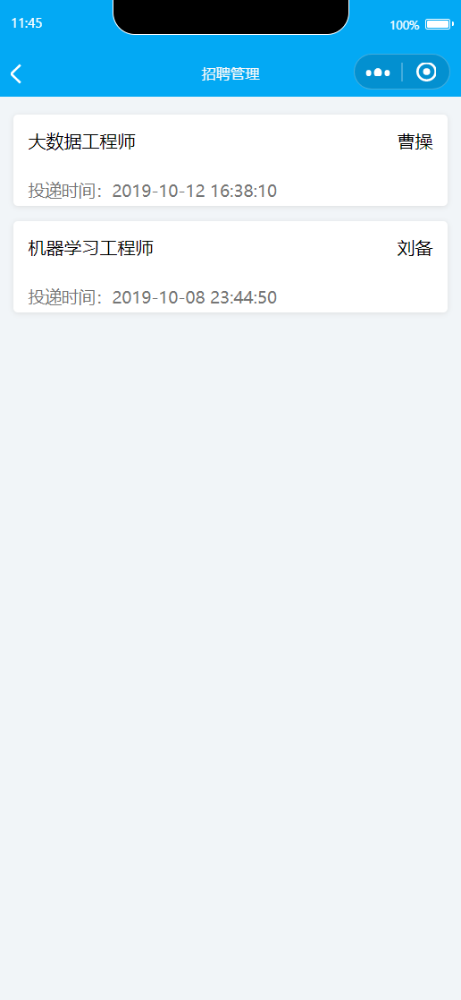</td>
		<td>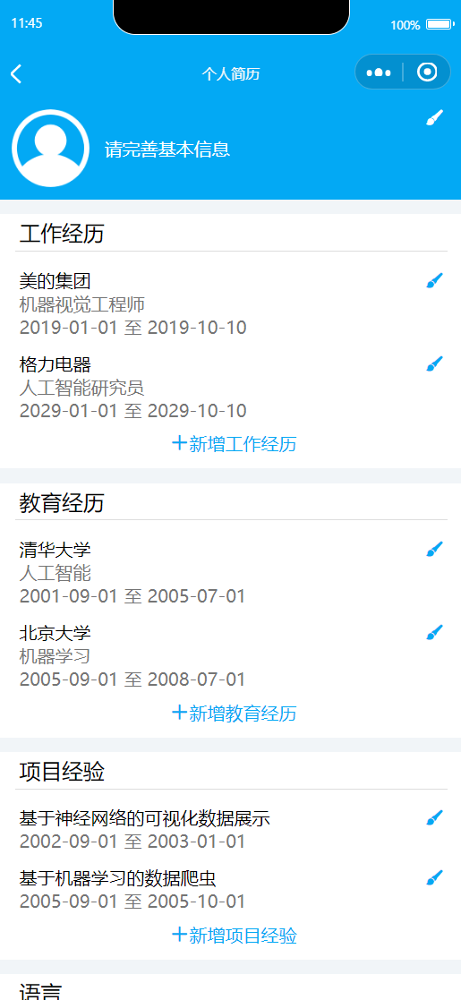</td>
		<td>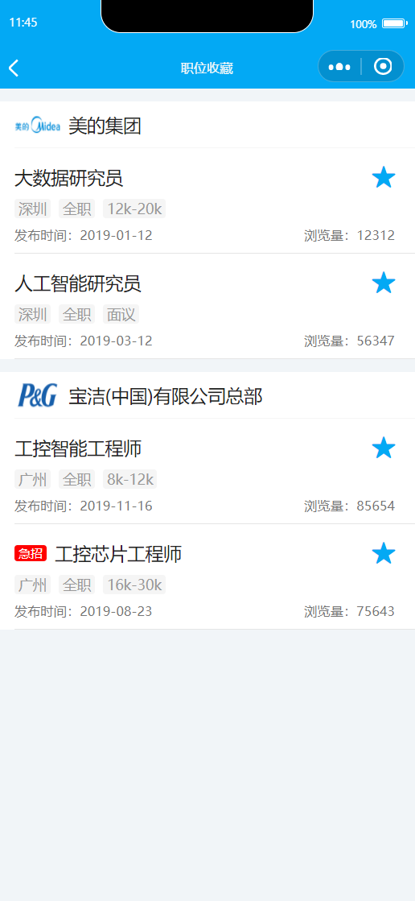</td>
	</tr>
	<tr>
		<td>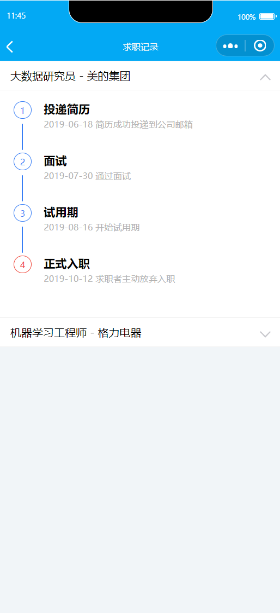</td>
	</tr>
</table>
